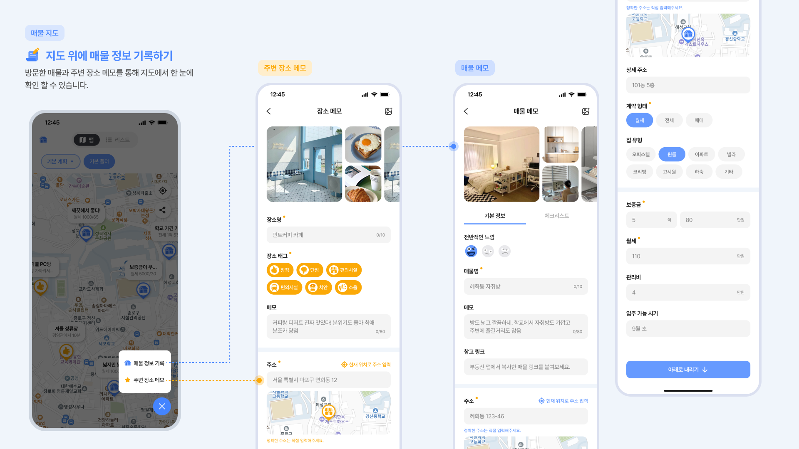
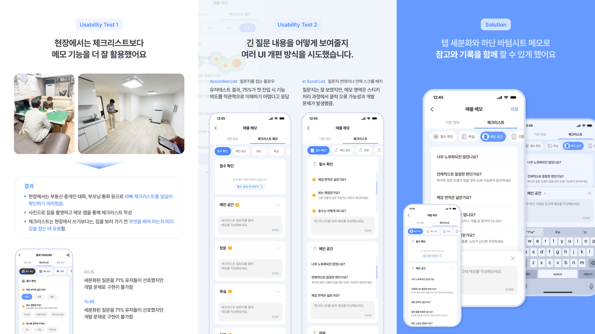
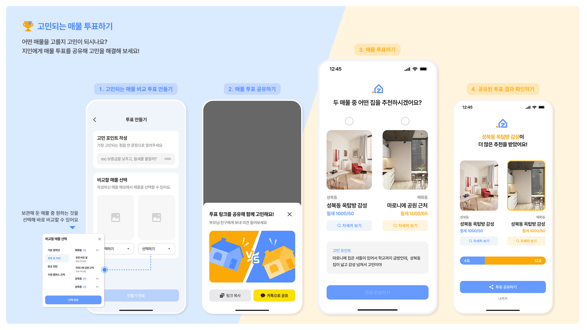

# 🏡 내 기준에 맞는 집 .zip! 해서 후회없게

## ❓ 왜 zip.zip일까요?

✔ 집 볼 때 무엇을 확인해야 할지 막막한가요?  
✔ 계약 후에 “그때 확인할 걸…” 하고 후회한 적 있나요?  
✔ 집 구조, 방향, 조건이 헷갈려 기억이 뒤죽박죽되나요?

👉 **zip.zip**은 내가 원하는 기준으로 집을 기록하고,  
주변의 조언을 더해 **확신 있는 선택**을 할 수 있게 돕는 자취방 구하기 서비스입니다 ✨

## 주요 기능

  
  
  
  

## Tech Stack

 
 

   
 
 

## TEAM

| Role        | Name / GitHub                               |
| ----------- | ------------------------------------------- |
| 🎨 Designer | 이수연                                      |
| 🎨 Designer | 우다현                                      |
| 💻 Frontend | [ujinsim](https://github.com/ujinsim프론트) |
| 💻 Frontend | [ydw1996](https://github.com/ydw1996)       |
| 🛠️ Backend  | [Daae-Kim](https://github.com/Daae-Kim)     |
| 🛠️ Backend  | [youabledev](https://github.com/youabledev) |

